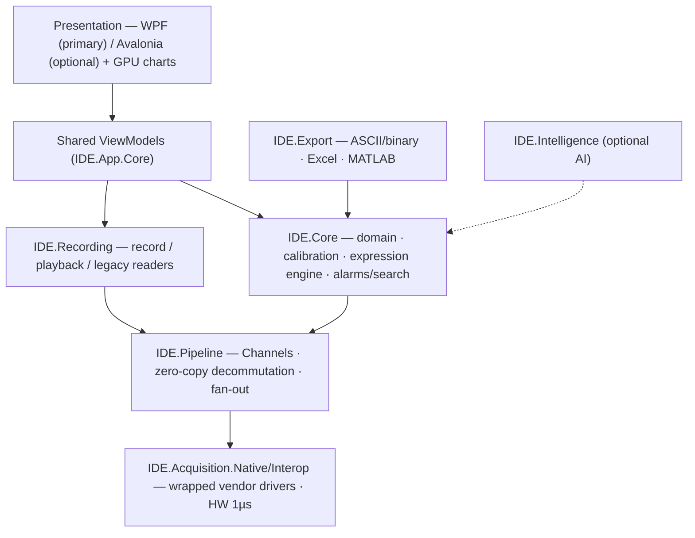

# IDE (Integrated Debriefing Environment) — MFC → .NET Modernization

> A proposal & architecture set for converting PLR Systems' **Integrated
> Debriefing Environment** — a Windows MFC/C++ flight-test telemetry application —
> into a modern, high-quality **.NET 10** application, **preserving functionality
> and efficiency**, with optional AI value-adds.
>
> Product page: [plris.com/component/products/IDE.php](https://www.plris.com/component/products/IDE.php)

---

## What IDE is (in one paragraph)

IDE is a **flight-test / telemetry debriefing workstation**. It acquires data live
from multiple avionics/test buses — **PCM, Ethernet, UART, MIL-STD-1553,
ARINC-429, digital I/O** — synchronized to **1 µs**, **records** it while
**displaying** it in real time across up to **1000 configurable pages** (X/t & X/Y
graphs, bars, gauges, stacks, tables, messages), and lets engineers **replay**
(forward/backward, variable speed, event marks, condition search, zoom) and
**export** (ASCII/binary, Excel, MATLAB). It is the analysis front-end for PLR's
HD/Digital/Telemetry/PCM recorders. Full breakdown:
[docs/01 — Product analysis](docs/01-product-analysis.md).

---

## Executive summary

We modernize via an **incremental, "wrap-the-core"** strategy: keep the proven,
hard-real-time **native acquisition/driver layer** (wrapped behind a clean managed
interface) and **rewrite everything above it** — domain model, engine,
recording/playback, export, and UI — in modern .NET, delivered **module-by-module**
(Data Dump → Setup → Debriefing). A **single UI-agnostic core** is shared by a
**WPF** front-end (primary) and an optional **Avalonia** front-end
(cross-platform). The data-dense real-time display is driven by a **commercial
GPU charting engine** (SciChart / LightningChart). Parity is enforced by
**golden-file** and **throughput** tests in CI.

---

## Locked decisions

| Decision | Choice | Detail |
|---|---|---|
| Deliverable | Proposal + architecture doc set (this repo) | + `CLAUDE.md` for future work |
| Primary UI | **WPF on .NET 10 (LTS), C# 14** | [docs/05](docs/05-ui-platform-options.md) |
| Alternative UI | **Avalonia** (cross-platform), shared core | [docs/05](docs/05-ui-platform-options.md) |
| Visualization | **Commercial GPU charting** (SciChart / LightningChart) | [docs/06](docs/06-visualization-layer.md) |
| Migration | **Incremental — wrap native core**, rewrite up the stack | [docs/02](docs/02-modernization-strategy.md) |
| App framework | CommunityToolkit.Mvvm 8.4 · Host/DI · `DynamicResource` theming | [docs/04](docs/04-technology-stack.md) |

---

## Current → target snapshot

| Aspect | Today (MFC/C++) | Target (.NET 10) |
|---|---|---|
| UI | MFC dialogs/views, GDI drawing | WPF/Avalonia + MVVM + GPU charts |
| Architecture | Doc/View, coupled | Layered, DI, UI-agnostic core |
| Real-time data | Native threads + `PostMessage` | Native capture wrapped → `Channel<T>` pipeline |
| Plots | Custom `OnDraw` | SciChart/LightningChart, decimated, GPU |
| Expressions | Built-in/user formulas | Compile-to-delegate engine |
| Testing | Limited | xUnit + golden-file parity + throughput in CI |
| Theming | Fixed | Runtime dark/light via `DynamicResource` |
| Extensibility | Hard | Clean seams (new buses, exports, **AI**) |

---

## Documentation index (recommended reading order)

| # | Document | Purpose |
|---|---|---|
| 01 | [Product analysis](docs/01-product-analysis.md) | What IDE does today; capability → modernization traceability |
| 02 | [Modernization strategy](docs/02-modernization-strategy.md) | Principles; why incremental "wrap-the-core" |
| 03 | [Target architecture](docs/03-target-architecture.md) | Layers, projects, seams, threading |
| 04 | [Technology stack](docs/04-technology-stack.md) | .NET 10, MVVM, DI, charting, interop, pipeline, testing |
| 05 | [UI platform options](docs/05-ui-platform-options.md) | WPF (primary) vs Avalonia (alt), separated + matrix |
| 06 | [Visualization layer](docs/06-visualization-layer.md) | GPU charting, real-time feeding, 1000-page system |
| 07 | [Data acquisition & interop](docs/07-data-acquisition-interop.md) | Wrapping native drivers, C++/CLI vs P/Invoke, 1 µs |
| 08 | [Core engine](docs/08-core-engine.md) | Domain model, calibration, expression engine, alarms |
| 09 | [Recording & playback](docs/09-recording-and-playback.md) | Loss-free record, playback, legacy formats |
| 10 | [Feature conversion examples](docs/10-feature-conversion-examples.md) | Concrete MFC → WPF/MVVM before/after |
| 11 | [Module implementation guide](docs/11-module-implementation-guide.md) | End-to-end recipe (Data Dump worked example) |
| 12 | [Migration roadmap](docs/12-migration-roadmap.md) | Phases, module order, team, timeline |
| 13 | [AI integration](docs/13-ai-integration.md) | Optional `IDE.Intelligence` value-adds |
| 14 | [Cross-cutting concerns](docs/14-cross-cutting-concerns.md) | Testing, theming, logging, security/ITAR, packaging |
| 15 | [Risks & mitigations](docs/15-risks-and-mitigations.md) | Risk register + burn-down by phase |
| 16 | [Discovery questions](docs/16-discovery-questions.md) | Exhaustive questions for PLR (★ = gating) |

---

## How to read this set

- **Decision-makers:** this README → [02 strategy](docs/02-modernization-strategy.md)
  → [12 roadmap](docs/12-migration-roadmap.md) → [15 risks](docs/15-risks-and-mitigations.md).
- **Architects/engineers:** [03](docs/03-target-architecture.md) →
  [04](docs/04-technology-stack.md) → subsystem docs [06–09] →
  [10](docs/10-feature-conversion-examples.md)/[11](docs/11-module-implementation-guide.md).
- **Before kickoff:** answer [16 — Discovery questions](docs/16-discovery-questions.md);
  the **★ gating** answers calibrate the roadmap and remove the biggest unknowns.

---

## Status

📄 **Proposal / architecture phase.** No application code yet — the MFC source is
not in hand. The immediate next step is **Phase 0 (Discovery & POC)** in the
[roadmap](docs/12-migration-roadmap.md): answer the gating questions, run the
charting and interop spikes, and calibrate estimates.

See [CLAUDE.md](CLAUDE.md) for how this repo is meant to evolve into the .NET
solution.
