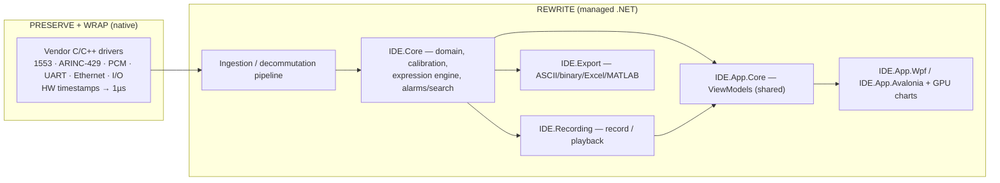

# 02 — Modernization Strategy

This document explains **how** we convert a large, mature MFC/C++ application into
a modern .NET product **without losing functionality or efficiency**, and **why**
we chose an incremental, "wrap-the-core" path over a big-bang rewrite.

---

## 1. Guiding principles

1. **Parity before improvement.** Every modernized feature must first match the
   legacy behavior (bit-exact where data is involved), proven by tests against
   the old app. *Then* we improve UX.
2. **Preserve what is proven and hard to rebuild.** The hard-real-time,
   hardware-bound acquisition code is the riskiest thing to rewrite — so we
   **keep and wrap it** rather than reimplement device drivers in managed code.
3. **Rewrite up the stack, in managed .NET.** Domain model, engine, recording,
   playback, export and UI are rebuilt with modern patterns — testable,
   maintainable, themeable.
4. **One core, two faces.** A UI-agnostic core (`IDE.Core` + ViewModels) is
   shared by a **WPF** front-end (primary) and an **Avalonia** front-end
   (optional, cross-platform). See [05](05-ui-platform-options.md).
5. **Ship value continuously.** Deliver module-by-module so PLR sees working
   software early and the legacy app is retired piece by piece.
6. **No silent regressions.** Performance and fidelity are gated by automated
   parity & throughput tests in CI.

---

## 2. Why not a big-bang rewrite?

| Risk of big-bang | Consequence |
|---|---|
| Rewriting real-time drivers in managed code | Determinism/latency regressions; long, risky bring-up on real hardware |
| "Boil the ocean" scope | Years before anything ships; high cancellation risk |
| Losing undocumented behavior | Subtle parity bugs discovered only in the field |
| Team ramp on .NET + domain at once | Slow start, low confidence |

A big-bang rewrite of an instrumentation app is the classic way to lose two
years and the customer's trust. We avoid it.

---

## 3. The chosen approach — incremental "wrap-the-core" (Strangler Fig)

We "strangle" the legacy app by routing its responsibilities, one module at a
time, into the new managed stack while the **wrapped native acquisition layer**
keeps providing proven, deterministic data.

### Module retirement order (least → most real-time risk)
1. **Data Dump** — batch, offline, no live constraints → the safest first
   vertical slice and our end-to-end proof of the pipeline & domain model.
2. **Setup** — rich UI, no hard real-time → exercises the domain model, the
   expression engine, and legacy-setup import.
3. **Debriefing Data** — real-time + playback → the hardest; done last, on top
   of a now-proven core and a validated charting/perf spike.

See the full plan in [12 — Migration roadmap](12-migration-roadmap.md).

---

## 4. What stays native vs what gets rewritten

| Layer | Decision | Rationale |
|---|---|---|
| Device drivers / vendor SDKs | **Stay native**, wrapped via C++/CLI or P/Invoke | Determinism; vendor support; avoid re-certifying low-level I/O |
| Frame/word capture + HW timestamping | **Stay native** (thin) | 1 µs sync must not depend on GC/JIT timing |
| Decommutation, calibration, expressions | **Rewrite** in .NET | Testable, evolvable; runs off the hard-real-time thread |
| Recording / playback | **Rewrite** in .NET | Modern async/MMF I/O; new + legacy formats |
| Export | **Rewrite** in .NET | Clean libraries (OpenXML, etc.) |
| UI / pages / charts | **Rewrite** in .NET | The whole point of the modernization |

The boundary is deliberately drawn **just above the hardware**: the smallest
possible native surface, wrapped behind a clean managed interface
(`IAcquisitionSource`). See [07](07-data-acquisition-interop.md).

---

## 5. Definition of done (parity gates)

A module is "done" only when:
- **Functional parity**: each legacy capability reproduced (traced via the table
  in [01 §7](01-product-analysis.md#7-capability--modernization-map-traceability)).
- **Data fidelity**: decommutation/calibration/export outputs are **bit/numerically
  identical** to legacy on a corpus of recorded files (golden-file tests).
- **Performance**: sustains target data rates with no dropped samples and live
  refresh within budget (throughput/latency tests in CI).
- **Quality bars**: unit + integration tests green; no `DynamicResource`/theming
  regressions; logging & diagnostics in place.

---

## 6. Success criteria for the program

- Legacy MFC app fully retired, all features modernized.
- Maintainable codebase (DI, MVVM, tests) that PLR engineers can extend.
- Same-or-better runtime efficiency on representative workloads.
- A clean seam for **optional AI** capabilities ([13](13-ai-integration.md))
  that the old architecture could not support.
- Optional cross-platform reach via the shared core ([05](05-ui-platform-options.md)).

---

## 7. Constraints that shape everything

- **Real-time determinism** on the acquisition path (no GC stalls).
- **Backward compatibility** with legacy setups & recordings.
- **Security / export control (ITAR/defense)** — see
  [14 §security](14-cross-cutting-concerns.md). May restrict AI/cloud usage and
  even source handling.
- **Windows-first**, cross-platform optional.

---

### Next
→ [03 — Target architecture](03-target-architecture.md)
