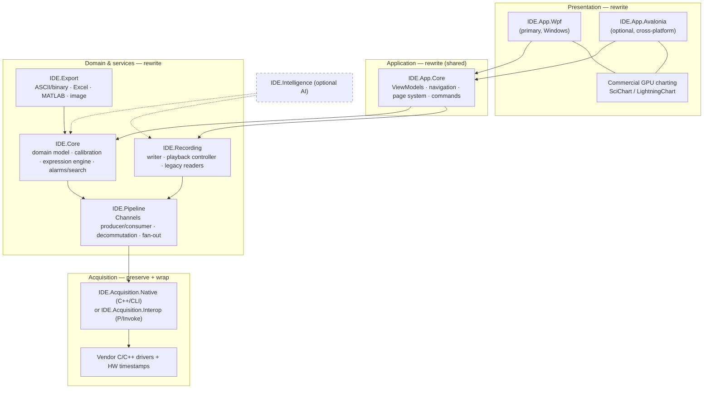
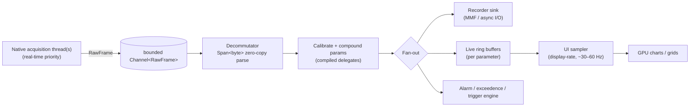

# 03 — Target Architecture

A layered, dependency-inverted architecture with a **single UI-agnostic core**
shared by both front-ends. The hard-real-time, hardware-bound layer is a thin
native shim; everything above it is modern, testable .NET.

---

## 1. Layered view



**Dependency rule:** arrows point *inward/downward*. `IDE.Core` depends on
nothing UI-related. Front-ends depend on `IDE.App.Core`; nobody depends on a
front-end. The native layer is reached only through an interface
(`IAcquisitionSource`), so it can be mocked, replayed, or swapped.

---

## 2. Projects / solution layout

```
IDE.sln
├─ src/
│  ├─ IDE.Core/                  # domain + engine (netX.0, no UI)
│  ├─ IDE.Pipeline/              # ingestion/decommutation (netX.0)
│  ├─ IDE.Recording/             # record/playback + legacy readers (netX.0)
│  ├─ IDE.Export/                # ASCII/binary/Excel/MATLAB (netX.0)
│  ├─ IDE.Acquisition.Abstractions/   # IAcquisitionSource, frame DTOs (netX.0)
│  ├─ IDE.Acquisition.Native/    # C++/CLI bridge (netX.0-windows)  ── Windows only
│  ├─ IDE.Acquisition.Interop/   # P/Invoke alternative (netX.0)
│  ├─ IDE.Acquisition.Replay/    # file-backed IAcquisitionSource (for tests/offline)
│  ├─ IDE.App.Core/              # shared ViewModels, services, navigation (netX.0)
│  ├─ IDE.App.Wpf/               # WPF views + chart bindings (netX.0-windows)
│  ├─ IDE.App.Avalonia/          # Avalonia views (netX.0)        ── optional
│  └─ IDE.Intelligence/          # optional AI (netX.0)
└─ tests/
   ├─ IDE.Core.Tests/
   ├─ IDE.Pipeline.Tests/
   ├─ IDE.Recording.Tests/
   ├─ IDE.Export.Tests/
   └─ IDE.App.UITests/           # UI automation (WinAppDriver / Avalonia.Headless)
```

Naming follows `{RootNamespace}.{PurposeSuffix}` (`IDE.*`). The **only**
Windows-pinned projects are `IDE.Acquisition.Native` and `IDE.App.Wpf`; the core
and most services are platform-neutral so Avalonia stays viable.

---

## 3. The acquisition seam (key abstraction)

```csharp
// IDE.Acquisition.Abstractions
public interface IAcquisitionSource
{
    IReadOnlyList<ChannelDescriptor> Channels { get; }

    /// Start streaming frames into the bounded channel. Frames carry the
    /// hardware timestamp (already synchronized to ≤1 µs by the native layer).
    ValueTask StartAsync(ChannelWriter<RawFrame> sink, CancellationToken ct);

    ValueTask StopAsync(CancellationToken ct);
}

public readonly record struct RawFrame(
    int ChannelId,
    long HardwareTicks,      // monotonic HW timestamp (IRIG/PTP-derived)
    BusType Bus,
    ReadOnlyMemory<byte> Payload);
```

Three implementations satisfy this seam:
- **`IDE.Acquisition.Native`** — real hardware via C++/CLI.
- **`IDE.Acquisition.Interop`** — real hardware via P/Invoke (when the SDK is C).
- **`IDE.Acquisition.Replay`** — reads a recording file and replays frames; lets
  the *entire* managed stack run and be tested with **no hardware**.

This seam is what makes the incremental strategy ([02](02-modernization-strategy.md))
practical: we can build and validate everything above it offline.

---

## 4. Threading & data-flow model



Principles:
- **Acquisition is decoupled from rendering.** The UI pulls *aggregated* data at
  display rate; it never processes per-sample on the UI thread.
- **Back-pressure, not drops.** Bounded channels apply back-pressure; recording
  must never drop samples (the recorder is the privileged consumer).
- **No GC on the hot path.** Pooled buffers (`ArrayPool<byte>`), `struct` frames,
  `Span<T>`/`Memory<T>`, pre-compiled expression delegates. See
  [04](04-technology-stack.md) and [07](07-data-acquisition-interop.md).

---

## 5. Composition root & DI

A single composition root (`App` startup) wires everything with the .NET Generic
Host. Front-ends register their view/charting services; the core registers
domain/services; the acquisition implementation is selected by configuration
(real hardware vs replay).

```csharp
// IDE.App.Wpf/App.xaml.cs (sketch — see 04 & dotnet-wpf-modern skill)
var host = Host.CreateApplicationBuilder()
    .AddIdeCore()              // IDE.Core services
    .AddIdePipeline()
    .AddIdeRecording()
    .AddIdeExport()
    .AddAcquisition(config)    // Native | Interop | Replay
    .AddWpfPresentation()      // ViewModels (IDE.App.Core) + WPF views + charts
    .Build();
```

---

## 6. Why this shape

- **Risk isolation** — the dangerous (real-time/native) part is tiny and behind
  an interface.
- **Testability** — the replay source makes the whole app testable without a lab.
- **Reuse** — one core, two UIs ([05](05-ui-platform-options.md)).
- **Evolvability** — AI, new buses, new exports plug in at clean seams.
- **Parity-friendly** — golden-file tests run against `IDE.Pipeline`/`IDE.Export`
  directly, independent of the UI.

---

### Next
→ [04 — Technology stack](04-technology-stack.md)
