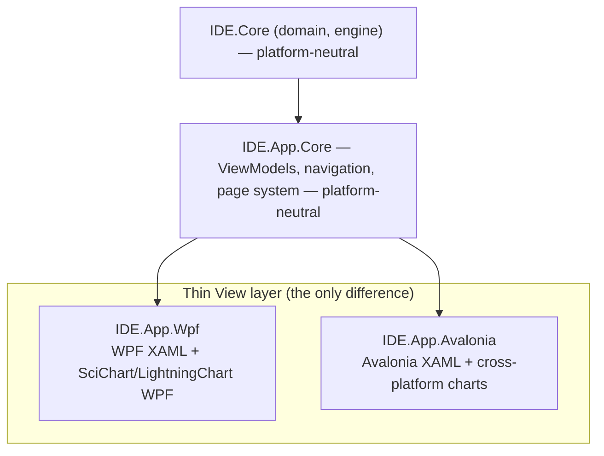

# 05 — UI Platform Options: WPF (primary) & Avalonia (alternative)

Two viable target stacks are presented, **cleanly separated**. Both build on the
**same** UI-agnostic core (`IDE.Core`) and the **same** ViewModels
(`IDE.App.Core`). The choice affects only the **View** layer and the chart-control
bindings — which is exactly why keeping the core platform-neutral
([03](03-target-architecture.md)) is worth the discipline.

> **Recommendation:** Ship **WPF on .NET 10** as the primary product (it matches
> the Windows flight-test reality and has the richest high-performance charting
> ecosystem). Keep **Avalonia** as a documented, low-cost pivot if/when a
> non-Windows target (Linux ground station, embedded rig) becomes a real
> requirement. Confirm the cross-platform need in
> [16 — Discovery questions](16-discovery-questions.md).

---

## Option A — WPF on .NET 10 *(primary)*

**What it is:** Microsoft's mature Windows desktop UI framework, fully supported
on .NET 10, with the deepest third-party ecosystem for data-dense engineering UIs.

**Strengths**
- **Best-in-class high-performance charting** — both **SciChart** and
  **LightningChart** ship first-class, GPU-accelerated **WPF** controls built for
  real-time telemetry. This is the decisive factor ([06](06-visualization-layer.md)).
- **Maturity & stability** — 15+ years of production use in instrumentation/SCADA;
  abundant controls, docs, and hiring pool.
- **Native interop** — clean `HwndHost` for hosting native windows during
  transition; straightforward C++/CLI consumption.
- **Tooling** — Visual Studio designer, profilers, UI automation (FlaUI/WinAppDriver).
- **Theming** — `DynamicResource` + `WindowChrome` give a modern look (dark mode,
  custom title bar) — see [skill:wpf-theming].

**Trade-offs**
- **Windows-only.**
- WPF's *native* rendering is not enough for high-rate plots — but that's solved
  by the commercial GPU charting engine, not by WPF itself.

**When to choose:** the app stays on Windows lab/ground workstations (the current
reality). **This is the default.**

---

## Option B — Avalonia *(cross-platform alternative)*

**What it is:** A modern, open-source, XAML-based UI framework that runs on
Windows, Linux, and macOS from one codebase — familiar to WPF developers.

**Strengths**
- **True cross-platform** — Linux/macOS ground stations or embedded test rigs
  from the same source.
- **WPF-like** — XAML + MVVM + `DynamicResource`; the `IDE.App.Core` ViewModels
  port with minimal change.
- **Headless test mode** — `Avalonia.Headless` enables fast UI tests in CI.
- **Active, modern** — strong momentum, good theming, GPU-backed rendering (Skia).

**Trade-offs**
- **Charting ecosystem is thinner** for *hard* real-time telemetry. LightningChart
  offers an Avalonia/cross-platform path and SkiaSharp-based options exist
  (ScottPlot/LiveCharts2), but the very-high-rate, many-channel story is less
  battle-tested than WPF + SciChart/LightningChart. **Validate with a perf spike
  before committing** ([06](06-visualization-layer.md)).
- Smaller (though growing) third-party control market and hiring pool.
- Some native-interop conveniences differ per OS.

**When to choose:** a concrete, funded requirement to run outside Windows.

---

## Side-by-side decision matrix

| Dimension | **WPF (.NET 10)** | **Avalonia** |
|---|---|---|
| OS targets | Windows only | Windows · Linux · macOS |
| Real-time charting maturity | ★★★★★ (SciChart/LightningChart WPF) | ★★★☆☆ (LightningChart XP / Skia-based; verify) |
| Ecosystem / controls | ★★★★★ | ★★★☆☆ |
| Hiring pool | ★★★★★ | ★★★☆☆ |
| Native interop (C++/CLI, HwndHost) | ★★★★★ | ★★★☆☆ (per-OS) |
| Tooling/designer/profilers | ★★★★★ | ★★★★☆ |
| Theming / dark mode | ★★★★★ | ★★★★☆ |
| Long-term portability | ★★☆☆☆ | ★★★★★ |
| Risk for *this* app today | Low | Medium (charting at rate) |

---

## The shared-core story (why either is safe)

Because ViewModels, commands, navigation, and the page model live in
`IDE.App.Core`, the platform decision is **reversible and localized**. We:
- Build WPF first.
- Keep all chart access behind a small `IChartView`/adapter interface so the
  charting vendor and the host framework are both swappable.
- If cross-platform is greenlit, add `IDE.App.Avalonia` reusing 80%+ of the
  presentation logic.

> **Action:** Treat "cross-platform required?" as a gating discovery question. If
> "no", we still keep the seams clean (cheap insurance); if "yes", we run the
> Avalonia charting perf spike during the roadmap's POC phase
> ([12](12-migration-roadmap.md)).

---

### Next
→ [06 — Visualization layer](06-visualization-layer.md)
