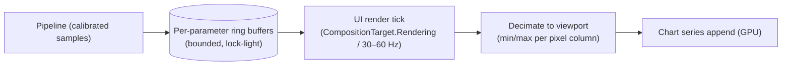
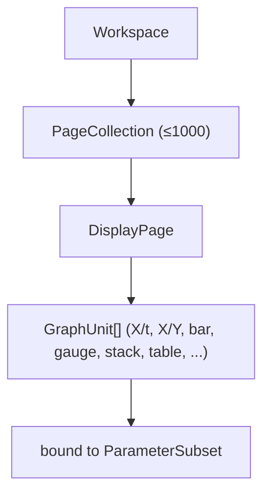

# 06 — Visualization Layer

The visualization layer is the **defining technical challenge**: IDE drives up to
**1000 pages** of data-dense, high-refresh graph units fed by high-rate telemetry.
This is where a naive WPF approach fails and where a **commercial GPU charting
engine** earns its license.

---

## 1. Graph-unit type → control mapping

Every legacy graph-unit type maps to a concrete modern control.

| Legacy graph unit | Modern realization | Notes |
|---|---|---|
| **X/t graph** (value vs time) | GPU line/scatter (SciChart `FastLineRenderableSeries` / LightningChart line series) | Scrolling real-time + zoomable history |
| **X/Y graph** | GPU XY series | Phase plots, correlations |
| **Bar** | GPU bar / column series | Live bar meters |
| **Gauge** | Vendor radial/linear gauge or custom | Analog-style indicators |
| **Stack** | Stacked strips / multi-axis stacked chart | Many params, shared time axis |
| **Table** | **Virtualized** `DataGrid` | Thousands of rows; UI virtualization mandatory |
| **Message** | Virtualized list / log view | 1553/ARINC message decode views |
| **String** | Text/value indicator | Formatted per display format |
| **Alarm/exceedence coloring** | Value→brush converters + threshold rules | Engine-driven ([08](08-core-engine.md)) |
| **Data formats** | Value formatters (dec/hex/literal/deg/ASCII/bin/time/custom) | Shared `IValueFormatter` |

---

## 2. Why commercial GPU charting

WPF's retained-mode rendering and standard chart controls cannot sustain
many channels at high sample rates. The chosen engines (**SciChart WPF** /
**LightningChart .NET**) are purpose-built for this:

- **GPU/DirectX rendering** of millions of points at interactive frame rates.
- **Real-time append** APIs with internal **decimation/resampling** (draw only
  what a pixel can show).
- **FIFO/rolling** data series for scrolling live views with bounded memory.
- Multi-axis, multi-pane, annotations, cursors, zoom/pan — matching IDE's needs.
- Aerospace/flight-test pedigree (LightningChart explicitly markets to the sector).

> **Selection:** Run a perf spike (POC phase, [12](12-migration-roadmap.md)) with
> *representative* channel counts and rates on both, then pick. Keep both behind an
> adapter (§5) so the choice is reversible.

---

## 3. Real-time feeding strategy

The chart is **not** fed per-sample from the acquisition thread. The pipeline
([03 §4](03-target-architecture.md#4-threading--data-flow-model)) writes into
per-parameter **ring buffers**; the UI samples them at display rate.



Key tactics:
- **Display-rate pull, not data-rate push** — decouples UI cost from data rate.
- **Min/max decimation per pixel** — preserves spikes while drawing ~viewport-width
  points, not millions.
- **Batched appends** — append blocks per tick, not per sample.
- **Bounded history** — rolling buffers; older data paged from the recording on
  zoom-out (playback path, [09](09-recording-and-playback.md)).
- **No allocations per tick** — reuse arrays; struct samples.

---

## 4. The page system (≤1000 pages)



- **Only the active page renders.** Inactive pages are lightweight definitions
  (no live chart resources). Switching a page activates/deactivates chart
  subscriptions — essential to scale to 1000 pages.
- **Page = data model**, designed in a **layout designer** (drag graph units,
  bind to parameters, set axes/limits/formats), serialized with the setup.
- **ViewModel-driven** (`PageViewModel`, `GraphUnitViewModel`) in `IDE.App.Core`
  so the page system is shared by WPF and Avalonia.
- **Subset binding** — a graph unit binds to a `ParameterSubset`; changing the
  subset re-wires series without rebuilding the page.

---

## 5. Charting abstraction (vendor and framework agnostic)

To keep both the **charting vendor** and the **UI framework** swappable, views
talk to charts through a thin adapter:

```csharp
// IDE.App.Core (abstraction)
public interface IRealtimeSeries
{
    void AppendBlock(ReadOnlySpan<double> times, ReadOnlySpan<double> values);
    void Clear();
    void SetVisibleRange(double tMin, double tMax);
}

public interface IChartHost
{
    IRealtimeSeries AddLineSeries(string id, AxisRef x, AxisRef y);
    void ApplyThreshold(string seriesId, ExceedenceRule rule); // alarm coloring
    byte[] ExportImage(ImageFormat format);                    // "copy pictures"
}
```

- **WPF** implements `IChartHost` over SciChart/LightningChart WPF controls.
- **Avalonia** implements it over the cross-platform engine.
- The **page system and ViewModels never reference a vendor type.**

---

## 6. Performance budget & guardrails

| Budget | Target (confirm with PLR) | Guard |
|---|---|---|
| UI refresh | 30–60 Hz, no dropped frames | render-tick decimation; profile in CI |
| Per-tick allocations | ~0 on steady state | pooled arrays; BenchmarkDotNet checks |
| Active series | hundreds, smoothly | GPU engine + decimation |
| Page switch | < ~100 ms | activate/deactivate, don't rebuild |
| Memory | bounded by ring sizes | rolling buffers; page from recording |

---

## 7. Parity checklist for this layer

- [ ] All graph-unit types reproduced and bindable to subsets.
- [ ] All value formats (dec/hex/literal/deg/ASCII/bin/time/custom).
- [ ] Alarm/exceedence coloring matches legacy thresholds.
- [ ] Time & axis zoom, cursors, event marks.
- [ ] Image copy/export.
- [ ] 1000-page workspace opens and switches without stalls.
- [ ] Sustains representative data rates (throughput test).

---

### Next
→ [07 — Data acquisition & interop](07-data-acquisition-interop.md)
