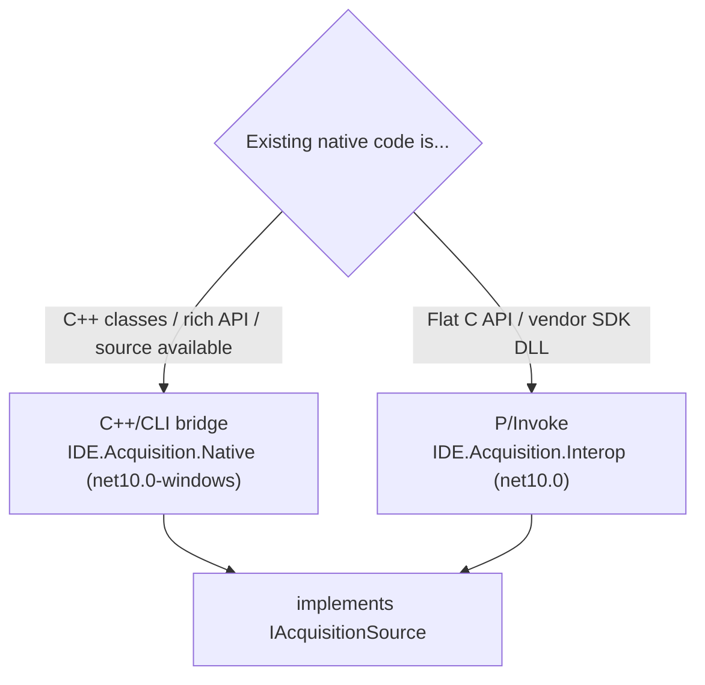

# 07 — Data Acquisition & Native Interop

This is the **preserve-and-wrap** layer — the smallest possible native surface,
hidden behind a clean managed interface. It is the linchpin of the incremental
strategy ([02](02-modernization-strategy.md)): if we get this seam right,
everything above it is ordinary, testable .NET.

> The single most important discovery item is **what native assets exist**
> (driver source? vendor SDKs? which versions?). See
> [16 — Discovery questions](16-discovery-questions.md). The design below works
> for both "we have C/C++ driver source" and "we call a vendor SDK".

---

## 1. What stays native (and why)

| Stays native | Reason |
|---|---|
| Vendor device drivers / SDK calls (1553, ARINC-429, PCM, UART, Ethernet, I/O) | Determinism; vendor support; avoid re-certifying I/O |
| Frame/word capture loop | Must not be subject to GC/JIT pauses |
| **Hardware timestamping** (IRIG/PTP) → the **1 µs** sync | Time base is hardware; managed code only *carries* it |

Everything else (decommutation, calibration, expressions, recording, UI) is
managed.

---

## 2. Bridge choice: C++/CLI vs P/Invoke



| Aspect | **C++/CLI** | **P/Invoke** |
|---|---|---|
| Best for | Wrapping existing **C++** classes/objects, callbacks, complex types | Flat **C** SDK functions / DLL exports |
| Marshaling | Author in C++ (full control, mixed mode) | Declarative `[DllImport]` / `LibraryImport` |
| Build | Windows-only MSVC; `net10.0-windows` | Portable project; works toward Avalonia/Linux if a Linux SDK exists |
| Perf | Excellent; can keep hot loop in native | Excellent for coarse-grained calls; avoid chatty per-sample calls |
| Recommendation | Use when reusing C++ driver **source/objects** | Use for vendor **SDK** DLLs with a C API |

Both implement the **same** `IAcquisitionSource` ([03 §3](03-target-architecture.md#3-the-acquisition-seam-key-abstraction)),
so the rest of the system is identical regardless of bridge.

---

## 3. The seam in practice

The native layer's job is narrow: **capture timestamped raw frames and hand them
to managed code with minimal copying.**

```csharp
// Managed consumer (IDE.Pipeline) — same for C++/CLI or P/Invoke source
await using var source = serviceProvider.GetRequiredService<IAcquisitionSource>();

var channel = Channel.CreateBounded<RawFrame>(new BoundedChannelOptions(capacity: 1 << 16)
{
    FullMode = BoundedChannelFullMode.Wait,   // back-pressure; recorder must keep up
    SingleReader = false, SingleWriter = false
});

await source.StartAsync(channel.Writer, ct);   // native threads push RawFrame
// pipeline reads channel.Reader → decommutate → calibrate → fan-out
```

```cpp
// IDE.Acquisition.Native (C++/CLI sketch) — bridges a native driver callback
public ref class NativeAcquisitionSource : IAcquisitionSource
{
    // native driver invokes this on its real-time thread
    void OnFrame(int ch, long long hwTicks, BusType bus, const unsigned char* p, int n)
    {
        // copy into a pooled managed buffer (bounded), then TryWrite to the ChannelWriter
        // keep this path allocation-light and lock-light
    }
};
```

P/Invoke equivalent uses `LibraryImport` for the SDK's start/stop/poll calls and a
pinned callback delegate (or a poll loop on a dedicated thread).

---

## 4. Threading, timing & determinism

- **Native capture thread(s)** run at real-time/high priority and do *only*
  capture + timestamp + enqueue. No parsing, no calibration there.
- **1 µs synchronization** is anchored to the **hardware** time base
  (IRIG-B/PTP/SDK timestamp). Managed code treats `HardwareTicks` as the
  authoritative clock and never re-derives it from `DateTime`/`Stopwatch`.
- **Back-pressure over dropping** — bounded `Channel<T>`; the **recorder** is the
  privileged consumer so recording is loss-free even if the live UI lags.
- **GC discipline on the hot path** — pooled buffers (`ArrayPool<byte>`),
  `struct RawFrame`, no LINQ/allocations in the per-frame loop. Consider Server GC
  / `GCLatencyMode.SustainedLowLatency` during acquisition.
- **Marshaling cost** — prefer **coarse-grained** native↔managed calls (hand over
  *blocks* of frames), never one interop call per sample.

---

## 5. Per-bus notes

| Bus | Capture concern | Decommutation (managed) |
|---|---|---|
| **PCM** | High rate; frame sync pattern | Frame/sub-frame map → words → parameters (bit/word position) |
| **MIL-STD-1553** | BC/RT/MT; command/status words | Message decode by RT/SA; sub-address mapping |
| **ARINC-429** | Label-based 32-bit words | Label/SDI/SSM decode; BCD/BNR scaling |
| **UART** | Framing/baud; lower rate | Protocol-specific message parse |
| **Ethernet** | Packetized; possibly UDP streams | Packet → message → parameters |
| **Digital I/O** | Discretes | Bit → boolean/state parameters |

The decommutation rules come from the **Setup** model ([08](08-core-engine.md));
the native layer is **bus-agnostic** beyond capture + timestamp.

---

## 6. Testing without hardware: the Replay source

`IDE.Acquisition.Replay` implements `IAcquisitionSource` by reading a recording
file and emitting `RawFrame`s with their original timestamps (optionally
time-scaled). This is critical:

- The **entire managed stack** (pipeline, engine, recording, UI) runs and is
  tested in CI with **no lab hardware**.
- **Golden-file parity** tests feed a known recording through the pipeline and
  compare calibrated output to legacy.
- Demos and development proceed off real recorded sessions.

---

## 7. Risks specific to this layer (see [15](15-risks-and-mitigations.md))

- Driver source/SDK **not available** or **undocumented** → may need vendor
  engagement or re-integration; mitigated by the narrow, well-defined seam.
- 1 µs sync source unclear → confirm IRIG/PTP/SDK timestamp path early.
- Real-time perf in mixed managed/native → validate in the POC with real rates.

---

### Next
→ [08 — Core engine](08-core-engine.md)
