# 08 — Core Engine (`IDE.Core`)

`IDE.Core` is the **UI-agnostic heart** of the product: the domain model, the
calibration & display-format services, the **compound-parameter expression
engine**, and the **alarm/exceedence/search** engine. It depends on nothing
UI-related and is the most heavily unit-tested assembly.

---

## 1. Domain model

```mermaid
classDiagram
    class Setup {
        +Guid Id
        +string Name
        +IList~DataSourceHandler~ Sources
        +IList~ParameterSubset~ Subsets
        +IList~DisplayPage~ Pages
    }
    class DataSourceHandler {
        +int ChannelId
        +BusType Bus
        +CommParameters Comm
        +IList~Message~ Messages
    }
    class Message {
        +int Id
        +IList~SubMessage~ SubMessages
        +IList~Parameter~ Parameters
    }
    class Parameter {
        +string Name
        +BitPosition Position
        +DataType Type
        +ICalibration Calibration
        +DisplayFormat Format
        +Limits Limits
    }
    class CompoundParameter {
        +string Name
        +string Expression
        +Func~EvalContext,double~ Compiled
    }
    Setup "1" --> "*" DataSourceHandler
    DataSourceHandler "1" --> "*" Message
    Message "1" --> "*" Parameter
    Setup "1" --> "*" ParameterSubset
    Setup "1" --> "*" DisplayPage
    Parameter <|-- CompoundParameter
```



These types mirror the legacy Setup vocabulary (DSH, message/sub-message,
parameter, subset, page) so the mapping is 1:1 and parity is checkable.

---

## 2. Calibration & display formatting

```csharp
public interface ICalibration
{
    double Apply(double raw);           // raw counts → engineering units
}

// Common implementations: PolynomialCalibration, PiecewiseLinear, TableLookup, Identity
public sealed class PolynomialCalibration(double[] coeffs) : ICalibration
{
    public double Apply(double raw)     // Horner's method, allocation-free
    {
        double acc = 0;
        for (int i = coeffs.Length - 1; i >= 0; i--) acc = acc * raw + coeffs[i];
        return acc;
    }
}

public interface IValueFormatter        // dec/hex/literal/deg/ASCII/bin/time/custom
{
    string Format(double value, DisplayFormat fmt);
}
```

Calibration is a **strategy** so new curve types are easy and each is unit-tested
against legacy outputs.

---

## 3. Compound-parameter expression engine

The legacy app lets users define parameters as "algebraic/logic
expressions/functions (both built-in and user defined)". The modern engine
**parses once and compiles to a delegate** for at-rate evaluation.

```csharp
public interface IExpressionCompiler
{
    // Compile "(P_altitude * 0.3048) + bias" into a fast delegate.
    CompiledExpression Compile(string expression, ExpressionContextSchema schema);
}

public sealed class CompiledExpression
{
    public Func<EvalContext, double> Evaluate { get; init; } // hot path: no parsing
    public IReadOnlyList<string> Dependencies { get; init; } // for invalidation/order
}
```

Design notes:
- **Start with a library** behind the interface — **DynamicExpresso** (lambda
  compile), **Jace.NET** (compiles to IL), or **Flee**. Swap to a **custom
  compile-to-delegate** engine later if profiling demands it.
- **Built-in functions** (`sin`, `abs`, `rate`, `delay`, logic ops, bit ops) plus
  **user-defined** functions registered in the schema.
- **Dependency graph** → evaluate compound params in topological order; detect
  cycles at compile time.
- **Hot-path rule:** evaluation allocates nothing and does no string work; all
  parsing happens at setup-load/compile time.

```csharp
// Pipeline usage (per sample block) — already compiled
foreach (var cp in orderedCompoundParams)
    ctx.Set(cp.Name, cp.Compiled.Evaluate(ctx));
```

---

## 4. Alarm / exceedence / trigger & search engine

Drives the "alarm and exceedence coloring", "trigger activation", and "search for
conditions (exceedences, counters, logical conditions)" features.

```csharp
public sealed record ExceedenceRule(string ParameterName, Comparison Op, double Threshold, Severity Severity);

public interface IConditionEngine
{
    // Live: evaluate rules each block; raise events for coloring/triggers.
    void Evaluate(EvalContext ctx, IList<ConditionHit> hits);

    // Playback/Dump: search a recording for the first/all matches.
    IAsyncEnumerable<ConditionHit> SearchAsync(IRecordingReader reader, Condition cond, CancellationToken ct);
}
```

- **Live mode** feeds chart coloring and trigger marks ([06](06-visualization-layer.md)).
- **Search mode** powers playback jump-to-condition and Data Dump filters
  ([09](09-recording-and-playback.md)).
- Conditions compose (logical AND/OR, counters, dwell time).

---

## 5. Setup persistence & legacy import

```csharp
public interface ISetupRepository
{
    Task<Setup> LoadAsync(string path, CancellationToken ct);
    Task SaveAsync(Setup setup, string path, CancellationToken ct);
}

public interface ILegacySetupImporter      // reads the MFC app's setup files
{
    bool CanImport(string path);
    Task<Setup> ImportAsync(string path, CancellationToken ct);
}
```

- **New format:** SQLite or structured (JSON/Protobuf) — robust, diffable,
  versioned.
- **Legacy importer:** a separate, well-tested component that reads existing setup
  files so customers keep their configurations. Exact format is a discovery item
  ([16](16-discovery-questions.md)).

---

## 6. Why `IDE.Core` has no UI dependency

- Reused by **both** WPF and Avalonia ([05](05-ui-platform-options.md)).
- Reused by **headless tools** (batch Data Dump, parity harness, CI).
- Enables **golden-file parity** tests independent of any view.
- Keeps the engine portable for future targets.

---

## 7. Parity checklist for the engine

- [ ] DSH/message/sub-message/parameter model round-trips legacy setups.
- [ ] All calibration curve types match legacy numerically.
- [ ] All value formats reproduced.
- [ ] Compound-parameter results bit/numerically identical on golden files.
- [ ] Exceedence/trigger/search semantics match legacy.
- [ ] Legacy setup import is lossless.

---

### Next
→ [09 — Recording & playback](09-recording-and-playback.md)
