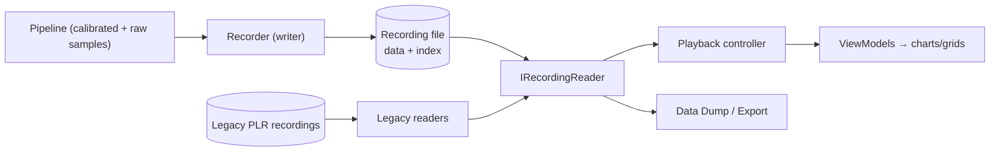

# 09 — Recording & Playback (`IDE.Recording`)

This subsystem reproduces two legacy capabilities: **recording concurrent with
live display**, and **playback** with forward/backward stepping, variable speed,
event marks, condition search, and time/axis zoom. It also owns **backward
compatibility** with existing PLR recordings.

---

## 1. Responsibilities



---

## 2. Recording (loss-free, high throughput)

Requirements implied by "real-time display concurrent with recording" + high data
rates ([01 §6](01-product-analysis.md#6-derived-non-functional-requirements)):

- **Loss-free:** the recorder is the **privileged consumer** on the pipeline's
  fan-out; back-pressure protects it.
- **High sustained write throughput:** **memory-mapped files** or async sequential
  I/O; large buffered writes; avoid per-sample syscalls.
- **Self-describing + indexed:** store the setup snapshot, channel/parameter
  schema, and a **time/event index** for fast seek.
- **Both raw and calibrated** retained as needed (raw guarantees re-processability;
  calibrated speeds replay).

```csharp
public interface IRecordingWriter : IAsyncDisposable
{
    Task BeginAsync(Setup setup, string path, CancellationToken ct);
    void WriteBlock(in SampleBlock block);   // called by the fan-out; allocation-light
    void MarkEvent(EventMark mark);          // event marks during recording
}
```

**On-disk format (new):** a versioned container — header (format version, setup
snapshot, schema), a sequence of time-ordered sample blocks, and a tail **index**
(time → file offset, plus event marks). Versioned so future changes stay readable.

---

## 3. Playback controller

Reproduces every legacy playback feature.

```csharp
public interface IPlaybackController
{
    PlaybackState State { get; }                  // Playing/Paused/Stepping
    double Speed { get; set; }                    // 0.1×…N×, negative = reverse
    TimeSpan Position { get; }

    Task PlayAsync(double speed, CancellationToken ct);
    void Pause();
    void Step(int frames);                        // forward (+) / backward (−)
    Task SeekAsync(TimeSpan t, CancellationToken ct);
    Task<TimeSpan?> FindAsync(Condition cond, SearchDirection dir, CancellationToken ct);
}
```

| Legacy feature | Mechanism |
|---|---|
| Forward/backward stepping | `Step(±n)` via the time index |
| Adjustable speed | `Speed` drives a playback clock that paces block emission |
| Reverse play | negative speed; index walked backward |
| Event marks | stored in index; surfaced as chart annotations |
| Condition search | `FindAsync` uses `IConditionEngine.SearchAsync` ([08](08-core-engine.md)) |
| Time/axis zoom | viewport range on charts; reader pages history on zoom-out |
| Sync of async channels | replay honors `HardwareTicks` to re-align channels |

**Paging on zoom-out:** live ring buffers hold recent data; when the user zooms
out or scrubs, the controller pages older samples from the recording on demand, so
memory stays bounded while history stays accessible ([06 §3](06-visualization-layer.md#3-real-time-feeding-strategy)).

---

## 4. Backward compatibility (mandatory)

IDE is the analysis front-end for PLR's **HD / Digital / Telemetry / PCM
recorders**, so the new app **must read existing recordings**.

```csharp
public interface IRecordingReader : IAsyncDisposable
{
    RecordingInfo Info { get; }                        // schema, duration, channels
    IAsyncEnumerable<SampleBlock> ReadAsync(TimeRange range, CancellationToken ct);
    Task<long> OffsetForTimeAsync(TimeSpan t);         // seek support
}

public interface IRecordingFormat                      // one per legacy/new format
{
    bool CanRead(string path);
    IRecordingReader Open(string path);
}
```

- One `IRecordingFormat` per legacy format + the new format; the reader factory
  picks by sniffing.
- **Video correlation (inferred):** PLR's video/data recorders pair video with
  parameters; if in scope, add a synchronized media track (timestamp-aligned
  playback). Confirm scope/containers in [16](16-discovery-questions.md).
- Exact legacy layouts are a **discovery item** — may need format docs or
  sample files to reverse-engineer; covered by golden-file tests.

---

## 5. Performance & integrity

| Concern | Approach |
|---|---|
| Write throughput | MMF/async sequential, large buffers, pooled memory |
| Seek speed | tail index (time/event → offset) |
| Memory | rolling live buffers + on-demand paging |
| Integrity | block checksums; recoverable tail if a session aborts |
| Re-processability | retain raw so calibration/expressions can be re-applied |

---

## 6. Parity checklist

- [ ] Loss-free recording at representative rates (throughput test).
- [ ] Read **all** required legacy recording formats (golden files).
- [ ] Forward/backward step, variable & reverse speed, seek.
- [ ] Event marks recorded and shown.
- [ ] Condition search jumps match legacy.
- [ ] Async channels re-aligned to ≤1 µs on replay.
- [ ] (If in scope) video correlated with data.

---

### Next
→ [10 — Feature conversion examples](10-feature-conversion-examples.md)
