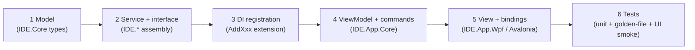

# 11 — Module Implementation Guide

A **repeatable recipe** for standing up a module end-to-end, illustrated on the
**Data Dump** module — the recommended **first vertical slice** because it is
offline/batch (no hard real-time) yet exercises the full stack: acquisition
(replay) → pipeline → core engine → export.

---

## 1. The recipe (applies to every module)



Each step has a clear owner assembly, so modules compose cleanly and stay testable.

---

## 2. Worked example — the Data Dump module

**Goal (parity with legacy):** convert recorded data to calibrated ASCII, extract
parameter subsets in binary, batch-process files, produce time-tagged output for
Excel/MATLAB.

### Step 1 — Model (`IDE.Core` / `IDE.Export`)
```csharp
public sealed record DumpRequest(
    string RecordingPath,
    ParameterSubset Subset,
    TimeRange Range,
    DumpFormat Format,           // CalibratedAscii | Binary | Xlsx | Matlab
    Condition? Filter = null);   // optional condition search ([08])

public sealed record DumpResult(string OutputPath, long RowCount, TimeSpan Elapsed);
```

### Step 2 — Service + interface (`IDE.Export`)
```csharp
public interface IDataDumpService
{
    Task<DumpResult> DumpAsync(DumpRequest req, IProgress<double>? progress, CancellationToken ct);
    Task<IReadOnlyList<DumpResult>> BatchAsync(IEnumerable<DumpRequest> reqs,
        IProgress<double>? progress, CancellationToken ct);
}

public sealed class DataDumpService(
    IRecordingFormatFactory formats,
    IExpressionCompiler expr,
    IEnumerable<IDumpWriter> writers) : IDataDumpService
{
    public async Task<DumpResult> DumpAsync(DumpRequest req, IProgress<double>? p, CancellationToken ct)
    {
        await using var reader = formats.Open(req.RecordingPath);          // legacy or new ([09])
        var writer = writers.Single(w => w.Format == req.Format);
        // stream blocks → calibrate + compound params → (optional) filter → write
        await foreach (var block in reader.ReadAsync(req.Range, ct))
        {
            var calibrated = Calibrate(block, req.Subset, expr);
            if (req.Filter is null || Matches(calibrated, req.Filter))
                writer.WriteRow(calibrated);
            p?.Report(reader.Progress);
        }
        return writer.Complete();
    }
}
```

### Step 3 — DI registration (`IDE.Export`)
```csharp
public static IServiceCollection AddIdeExport(this IServiceCollection s)
{
    s.AddSingleton<IDataDumpService, DataDumpService>();
    s.AddSingleton<IDumpWriter, CalibratedAsciiWriter>();
    s.AddSingleton<IDumpWriter, BinaryWriter>();
    s.AddSingleton<IDumpWriter, XlsxWriter>();      // ClosedXML
    s.AddSingleton<IDumpWriter, MatlabWriter>();    // .mat or CSV fallback
    return s;
}
```

### Step 4 — ViewModel + commands (`IDE.App.Core`)
```csharp
public sealed partial class DataDumpViewModel(IDataDumpService dump, IDialogService dialogs)
    : ObservableObject
{
    [ObservableProperty] private string? _recordingPath;
    [ObservableProperty] private DumpFormat _format = DumpFormat.CalibratedAscii;
    [ObservableProperty] private double _progress;
    [ObservableProperty] private ParameterSubset? _subset;

    [RelayCommand(CanExecute = nameof(CanRun))]
    private async Task RunAsync(CancellationToken ct)
    {
        var req = new DumpRequest(RecordingPath!, Subset!, TimeRange.All, Format);
        var result = await dump.DumpAsync(req, new Progress<double>(v => Progress = v), ct);
        await dialogs.InfoAsync($"Wrote {result.RowCount} rows → {result.OutputPath}");
    }
    private bool CanRun() => RecordingPath is not null && Subset is not null;
}
```

### Step 5 — View + bindings (`IDE.App.Wpf`)
```xml
<StackPanel>
  <Button Content="Open recording…" Command="{Binding OpenRecordingCommand}"/>
  <ComboBox ItemsSource="{Binding Subsets}" SelectedItem="{Binding Subset}"/>
  <ComboBox ItemsSource="{Binding Formats}" SelectedItem="{Binding Format}"/>
  <Button Content="Run" Command="{Binding RunCommand}"/>
  <ProgressBar Value="{Binding Progress}" Maximum="1"/>
</StackPanel>
```

### Step 6 — Tests
- **Unit:** `DataDumpService` over a synthetic recording; each `IDumpWriter`.
- **Golden-file (parity):** run a real legacy recording through `DumpAsync` and
  compare ASCII/binary output **byte/numerically** to the legacy app's output.
- **UI smoke:** open → pick subset → run → file exists (FlaUI / Avalonia.Headless).

---

## 3. Applying the recipe to the other modules

### Setup module (second slice)
- **Model:** the full domain ([08](08-core-engine.md)).
- **Services:** `ISetupRepository`, `ILegacySetupImporter`, `IExpressionCompiler`.
- **ViewModels:** tree of DSH → message → parameter editors; subset & page designers.
- **Views:** master/detail editors; the **page layout designer** (drag graph units,
  bind subsets) — reused by Debriefing.
- **Tests:** legacy-setup import round-trip; expression compile/eval; validation.

### Debriefing Data module (last slice — hardest)
- **Model/services:** live pipeline ([03](03-target-architecture.md)/[07](07-data-acquisition-interop.md)),
  `IPlaybackController` ([09](09-recording-and-playback.md)), `IConditionEngine` ([08](08-core-engine.md)).
- **ViewModels:** `DebriefingViewModel`, `PageViewModel`, `GraphUnitViewModel`,
  playback transport VM.
- **Views:** the page system with GPU charts ([06](06-visualization-layer.md));
  transport controls; alarm coloring; event marks.
- **Tests:** throughput/loss-free; replay determinism; condition-search parity;
  page-switch performance.

---

## 4. Definition of done for any module

Tie back to the parity gates in
[02 §5](02-modernization-strategy.md#5-definition-of-done-parity-gates):
functional parity ✓, data fidelity (golden files) ✓, performance budget ✓, tests
green ✓, theming/logging clean ✓.

---

### Next
→ [12 — Migration roadmap](12-migration-roadmap.md)
