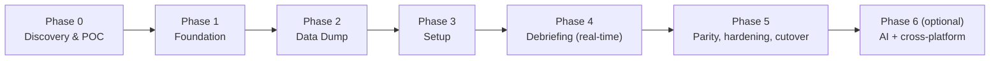

# 12 — Migration Roadmap

A phased plan that ships value continuously and retires the legacy app
module-by-module, lowest real-time risk first. Durations are **relative
T-shirt estimates** to be calibrated once codebase size, data rates, and driver
availability are known ([16](16-discovery-questions.md)).

---

## 1. Phases at a glance

```mermaid
gantt
    title Indicative timeline (calibrate after Discovery)
    dateFormat  X
    axisFormat  %s
    section Setup
    Discovery & POC        :p0, 0, 2
    Foundation             :p1, 2, 2
    section Modules
    Data Dump              :p2, 4, 2
    Setup                  :p3, 6, 3
    Debriefing (real-time) :p4, 9, 4
    section Close
    Parity & cutover       :p5, 13, 2
    AI + cross-platform    :p6, 15, 3
```

---

## 2. Phase detail

### Phase 0 — Discovery & POC *(de-risk the unknowns)*
- Answer the [discovery questions](16-discovery-questions.md): driver/SDK assets,
  data rates, legacy formats, cross-platform need, AI/ITAR posture.
- **Charting perf spike:** SciChart vs LightningChart at representative rates →
  vendor decision ([06](06-visualization-layer.md)).
- **Interop spike:** wrap one real bus (or vendor SDK) behind `IAcquisitionSource`;
  prove ≤1 µs timestamp flow ([07](07-data-acquisition-interop.md)).
- **Replay spike:** read one legacy recording; replay through a skeleton pipeline.
- **Exit criteria:** vendor chosen, interop proven, rates met in a thin slice,
  estimates calibrated.

### Phase 1 — Foundation *(the skeleton everything hangs on)*
- Solution & projects ([03 §2](03-target-architecture.md#2-projects--solution-layout)),
  Generic Host + DI, logging, theming, navigation, CI with parity/perf gates.
- `IDE.Acquisition.Abstractions` + `IDE.Acquisition.Replay`; `IDE.Pipeline` core.
- **Exit criteria:** app shell runs; replay→pipeline→a basic chart works in CI.

### Phase 2 — Data Dump *(first user-visible module)*
- Implement per [11](11-module-implementation-guide.md); legacy recording readers;
  Excel/MATLAB/ASCII/binary writers.
- **Golden-file parity** vs legacy dumps.
- **Exit criteria:** Data Dump at parity; legacy dump usage can stop.

### Phase 3 — Setup *(domain + expression engine + import)*
- Full domain model, calibration, **compound-parameter expression engine**,
  validation; **legacy setup import**; page **layout designer**.
- **Exit criteria:** create/import/edit setups at parity; setups drive Data Dump.

### Phase 4 — Debriefing Data *(real-time — the hard part, now de-risked)*
- Native acquisition via `IDE.Acquisition.Native/Interop`; live pipeline; GPU page
  system; playback controller; alarms/triggers/search; event marks.
- **Exit criteria:** live capture+record+display at representative rates,
  loss-free; playback & search at parity; 1000-page workspace smooth.

### Phase 5 — Parity, hardening & cutover
- Full parity sweep against the [01 §7 traceability table](01-product-analysis.md#7-capability--modernization-map-traceability);
  perf hardening; docs; packaging (MSIX/self-contained); pilot with engineers;
  **decommission the MFC app**.

### Phase 6 — Optional value-adds
- **AI** ([13](13-ai-integration.md)) and/or **Avalonia cross-platform**
  ([05](05-ui-platform-options.md)), each gated by a real requirement.

---

## 3. Module order rationale

| Order | Module | Why here |
|---|---|---|
| 1 | Data Dump | Offline/batch; proves pipeline+engine+formats with zero real-time risk |
| 2 | Setup | Builds the domain & expression engine the others need; no hard real-time |
| 3 | Debriefing | Hardest (real-time + charts); done last on a proven core |

---

## 4. Team & skills

| Role | Focus |
|---|---|
| .NET/WPF lead | Architecture, DI/MVVM, page system, navigation |
| Interop/real-time engineer | C++/CLI or P/Invoke, drivers, pipeline, GC discipline |
| Charting specialist | SciChart/LightningChart integration & perf tuning |
| Domain/test engineer | Calibration/expressions, golden-file parity harness |
| (Phase 6) ML/AI engineer | Anomaly detection, NL/summary features |

A few engineers can cover multiple roles; the **interop + charting** skills are
the scarce, critical ones to secure early.

---

## 5. Cross-cutting throughout

CI parity & throughput gates, theming, logging/diagnostics, and security/ITAR
handling run in **every** phase, not at the end — see
[14 — Cross-cutting concerns](14-cross-cutting-concerns.md). Risks are tracked in
[15 — Risks & mitigations](15-risks-and-mitigations.md).

---

### Next
→ [13 — AI integration](13-ai-integration.md)
