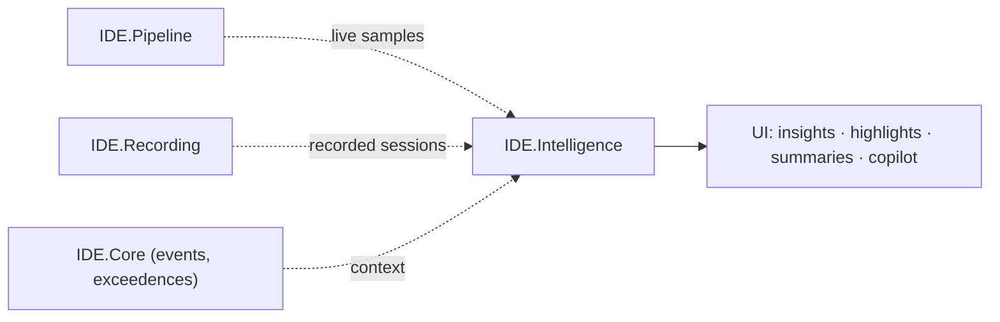

# 13 — AI Integration (optional `IDE.Intelligence`)

AI is an **advantage, not a requirement** (per the job brief). The modern
architecture makes it a clean, opt-in module (`IDE.Intelligence`) that plugs into
the existing seams — something the MFC app could not practically support. Nothing
here is on the critical path; all of it is gated by a real requirement and by
**data-governance/export-control** constraints ([14 §security](14-cross-cutting-concerns.md)).

---

## 1. Where AI plugs in



The AI module **consumes** the same calibrated streams and recordings everything
else uses, and **surfaces** results through ordinary ViewModels — no special
coupling.

---

## 2. Candidate capabilities (ranked by value/effort)

| # | Capability | What it does | Tech | On-prem? |
|---|---|---|---|---|
| 1 | **Anomaly / exceedence detection** | Flag abnormal parameter behavior beyond static thresholds (drift, spikes, correlations) | **ML.NET** time-series (SSA/spike), classic stats | ✅ fully local |
| 2 | **Auto test/flight summary** | Generate a readable debrief summary from the event/exceedence log + key stats | LLM (local or approved) over structured facts | ⚠️ depends |
| 3 | **Natural-language query** | "show where engine temp > 900 during climb" → jumps/charts | NL → `Condition` ([08](08-core-engine.md)); LLM or grammar | ⚠️/✅ |
| 4 | **Setup copilot** | Turn a description/datasheet into parameter/calibration drafts | LLM-assisted; human-confirmed | ⚠️ depends |
| 5 | **Predictive trend / RUL** | Trend wear/limits across sessions | ML.NET regression/forecast | ✅ fully local |
| 6 | **Smart search across recordings** | Find "similar events" by signature | embeddings/similarity, local index | ✅ fully local |

> Start with **#1 (anomaly detection)** — highest value, **fully local**, no
> cloud/export-control issues, and it directly augments the existing exceedence
> feature.

---

## 3. Design principles for AI here

1. **Human-in-the-loop.** AI **suggests**; engineers confirm. Especially for
   Setup copilot and NL→condition (always show the resolved condition before running).
2. **Local-first.** Prefer **ML.NET** and on-device models; treat any cloud/LLM as
   **opt-in, configurable, and disable-able** — defense labs are often air-gapped.
3. **Explainable.** Surface *why* something was flagged (which parameter, when,
   how far out of family), not just a score.
4. **Deterministic core stays deterministic.** AI is a side-channel; it never sits
   on the loss-free recording path.
5. **Governed data.** No telemetry leaves the boundary without explicit policy;
   audit any external call.

---

## 4. Example — anomaly detection (fully local)

```csharp
public interface IAnomalyDetector
{
    // Train/update a per-parameter model from historical sessions.
    Task TrainAsync(string parameter, IRecordingReader history, CancellationToken ct);

    // Score live or recorded samples; emit anomalies for chart highlighting.
    IAsyncEnumerable<AnomalyHit> DetectAsync(string parameter,
        IAsyncEnumerable<Sample> stream, CancellationToken ct);
}
// Implementation: ML.NET (e.g., DetectAnomalyBySrCnn / SSA spike & change-point).
```

`AnomalyHit`s render exactly like exceedences ([06](06-visualization-layer.md)) —
coloring + marks — so the feature feels native.

---

## 5. Example — NL query → condition (safe pattern)

```
User: "highlight where altitude dropped more than 500 ft in 2 seconds after takeoff"
        │
        ▼  (LLM or grammar maps to a typed Condition — shown to the user)
Condition: rate(P_altitude, 2s) < -500  AND  phase == AfterTakeoff
        │  user confirms ───────────────► IConditionEngine.SearchAsync ([08]/[09])
        ▼
Result: playback jumps + chart marks
```

The AI only **produces a typed `Condition`**; the deterministic engine executes
it. This keeps results trustworthy and auditable.

---

## 6. If/when to build it

Sequenced as **Phase 6** ([12](12-migration-roadmap.md)) after parity, unless PLR
prioritizes a specific capability earlier. Gate each feature on:
- a concrete user need,
- an allowed data-governance path (local vs external),
- export-control sign-off.

Confirm appetite and constraints in
[16 — Discovery questions](16-discovery-questions.md).

---

### Next
→ [14 — Cross-cutting concerns](14-cross-cutting-concerns.md)
