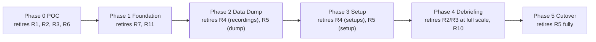

# 15 — Risks & Mitigations

A living risk register. **Likelihood (L)** and **Impact (I)**: H/M/L. Sorted by
exposure. Each risk has an owner-able mitigation and, where useful, a fallback.

---

## 1. Top risks

| # | Risk | L | I | Mitigation | Fallback |
|---|---|---|---|---|---|
| R1 | **Native driver/SDK source unavailable or undocumented** (linchpin of wrap-the-core) | M | H | Confirm assets in Discovery ([16](16-discovery-questions.md)); design the narrow `IAcquisitionSource` seam so either source-wrap or SDK-call works ([07](07-data-acquisition-interop.md)) | Engage hardware vendors; re-integrate via vendor SDK; isolate per-bus |
| R2 | **Real-time perf/determinism in managed code** (dropped samples, GC stalls) | M | H | POC throughput spike with real rates; pooled buffers, `Span<T>`, struct frames, SustainedLowLatency GC; native capture thread; CI throughput gates ([04](04-technology-stack.md)/[07](07-data-acquisition-interop.md)) | Push more of the hot loop into native; widen buffers; dedicate cores |
| R3 | **Charting can't sustain rates/channels** | L | H | Commercial GPU engine + decimation; perf spike on SciChart **and** LightningChart before choosing ([06](06-visualization-layer.md)) | Switch vendor (behind `IChartHost`); custom SkiaSharp/Direct2D renderer |
| R4 | **Legacy file formats (setups & recordings) hard to reverse-engineer** | M | H | Ask for format docs/sample files early; build readers behind interfaces; golden-file tests ([08](08-core-engine.md)/[09](09-recording-and-playback.md)) | Vendor-assisted spec; converter tool from legacy app |
| R5 | **Scope / parity creep** (undocumented legacy behavior) | M | M | Traceability table ([01 §7](01-product-analysis.md#7-capability--modernization-map-traceability)); parity gates; golden files capture real behavior | Time-box parity per module; defer cosmetic differences |
| R6 | **1 µs synchronization source unclear** | M | M | Confirm IRIG/PTP/SDK timestamp path in Discovery; carry `HardwareTicks` end-to-end ([07](07-data-acquisition-interop.md)) | Hardware-timestamp adapter; document achievable accuracy |
| R7 | **Team ramp on .NET/real-time/charting** | M | M | Secure interop + charting specialists early; pair on Phase 0/1; conventions in [skill:dotnet-wpf-modern] | Short-term external specialists |
| R8 | **Export-control/ITAR limits on source, data, AI/cloud** | M | M | Treat offline-first as a requirement; local-first AI; policy-gate any external call ([14 §7](14-cross-cutting-concerns.md)) | Drop cloud features; on-prem only |
| R9 | **Commercial charting license cost/terms** (runtime/redistribution) | M | M | Clarify licensing during vendor eval; budget for it | Open-source path (ScottPlot/LiveCharts2) with perf caveats |
| R10 | **Video correlation scope** (recorders pair video+data) | M | M | Confirm if in scope + container formats ([16](16-discovery-questions.md)); add synced media track if needed ([09](09-recording-and-playback.md)) | Defer video to a later phase |
| R11 | **Big-bang temptation / long no-ship stretch** | L | H | Strangler approach; Data Dump ships first; module-by-module retirement ([02](02-modernization-strategy.md)/[12](12-migration-roadmap.md)) | Re-scope to thinner slices |
| R12 | **Cross-platform charting weaker (if Avalonia greenlit)** | M | M | Run Avalonia charting spike before committing ([05](05-ui-platform-options.md)) | Keep WPF as primary; Avalonia for non-real-time views first |

---

## 2. Risk burn-down by phase

The roadmap is deliberately ordered so the **highest-impact technical risks
(R1–R3, R6)** are bought down **first**, in the POC, before large investment.

---

## 3. Watch-items (lower exposure, keep visible)

- Dependency/license drift (SBOM, pinned versions) — [14 §7](14-cross-cutting-concerns.md).
- High-DPI/multi-monitor edge cases on engineering rigs — [14 §5](14-cross-cutting-concerns.md).
- Localization/RTL if Hebrew UI is later required — [14 §6](14-cross-cutting-concerns.md).

---

### Next
→ [16 — Discovery questions](16-discovery-questions.md)
